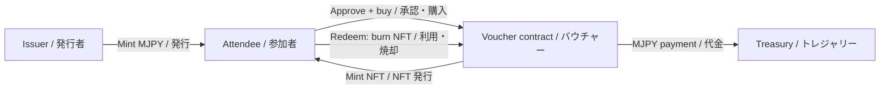
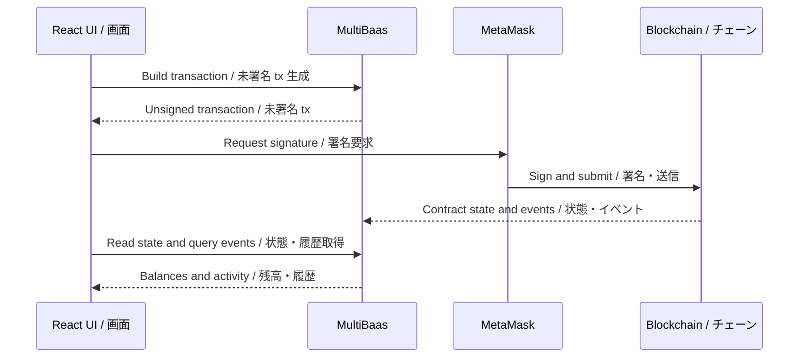

# 🏮 Matsuri Stablecoin Demo / まつりステーブルコインデモ

## TL;DR / 要点

**EN:** A festival ticket demo on **MIZUHIKI Testnet Awaji** (or Ethereum Sepolia). The issuer mints **Matsuri Yen (MJPY)**, a demo ERC20 token. Attendees approve MJPY spending, buy non-transferable ERC721 vouchers, and redeem them by burning the NFTs. Payments go to the issuer's treasury. **MultiBaas is required:** it reads contracts, builds unsigned transactions, and indexes events for the dashboard; **MetaMask signs and submits transactions**. MJPY has no fiat backing or peg mechanism. **MIZU pays gas on Awaji; MJPY buys vouchers.**

**JP:** **MIZUHIKI Testnet Awaji**（または Ethereum Sepolia）上で動く、まつりのチケットデモです。発行者がデモ用 ERC20 トークン **Matsuri Yen（MJPY）** を発行します。参加者は MJPY の支払いを承認し、譲渡不可の ERC721 バウチャーを購入し、NFT を焼却して利用します。代金は発行者のトレジャリーへ送られます。**MultiBaas は必須です。** コントラクトの読み取り、未署名トランザクションの生成、ダッシュボード用のイベント集計を担当し、**MetaMask が署名・送信します。** MJPY に法定通貨の裏付けやペッグ機構はありません。**Awaji のガス代は MIZU、バウチャー代金は MJPY です。**

## How it works / 仕組み



**EN:** React calls MultiBaas using its TypeScript SDK. Reads return contract state; writes return an unsigned transaction for MetaMask. MultiBaas Event Queries calculate account balances from ERC20 `Transfer` events and show voucher purchase/redemption history. There is no separate application server.

**JP:** React は TypeScript SDK で MultiBaas を呼び出します。読み取りではコントラクトの状態を取得し、書き込みでは MetaMask 用の未署名トランザクションを取得します。MultiBaas Event Queries は ERC20 の `Transfer` イベントから口座残高を集計し、バウチャーの購入・利用履歴を表示します。別途アプリケーションサーバーは不要です。



## Prerequisites / 必要なもの

**EN:** Use Node.js **24 LTS** (`nvm use` reads `.nvmrc`), npm, MetaMask, and a [MultiBaas deployment](https://docs.curvegrid.com/multibaas/getting-started/account-and-deployment) connected to your chosen network. Fund the deployer and attendee wallets with that network's gas token. The Hardhat MultiBaas plugin requires Node 24 or newer. This repo has two independent npm projects; run commands in the indicated directory.

**JP:** Node.js **24 LTS**（`nvm use` は `.nvmrc` を参照）、npm、MetaMask、および対象ネットワークに接続した [MultiBaas デプロイメント](https://docs.curvegrid.com/ja/multibaas/getting-started/account-and-deployment)を用意してください。デプロイ用と参加者用のウォレットに対象ネットワークのガストークンを入金します。Hardhat MultiBaas プラグインは Node 24 以上が必要です。このリポジトリには独立した npm プロジェクトが2つあります。各コマンドは指定されたディレクトリで実行してください。

## Network settings / ネットワーク設定

| Field / 項目 | Awaji (default / 既定) | Sepolia |
| --- | --- | --- |
| Network / ネットワーク | MIZUHIKI Testnet Awaji | Ethereum Sepolia |
| Chain ID / チェーン ID | `6497` (`0x1961`) | `11155111` (`0xaa36a7`) |
| RPC URL | `https://rpc.awaji.mizuhiki.io` | `https://rpc.sepolia.org` |
| Gas currency / ガス通貨 | MIZU | ETH |
| Explorer / エクスプローラー | https://awaji.blockscout.com | https://sepolia.etherscan.io |

**EN:** The wallet selector only changes the MetaMask network. It does **not** switch the configured MultiBaas deployment or contract aliases. Keep the wallet, deployment network, and MultiBaas chain aligned. To use Sepolia, deploy there and configure the frontend for that MultiBaas deployment with `VITE_DEFAULT_CHAIN=sepolia`.

**JP:** ウォレットのネットワーク選択は MetaMask の接続先のみを変更します。設定済みの MultiBaas デプロイメントやコントラクトエイリアスは切り替わりません。ウォレット・デプロイ先・MultiBaas のチェーンを一致させてください。Sepolia を使う場合は Sepolia にデプロイし、対応する MultiBaas 接続情報と `VITE_DEFAULT_CHAIN=sepolia` をフロントエンドに設定します。

## Setup / セットアップ

### 1. Deploy and link contracts / コントラクトのデプロイと紐付け

**EN:** From the repository root:

**JP:** リポジトリのルートから実行します。

```bash
cd contracts
cp .env.example .env
npm ci
```

**EN:** Fill in `contracts/.env` before deploying. `MB_HOST` is your MultiBaas deployment URL; `MB_ADMIN_API_KEY` is an admin key used by the deployment plugin. Keep it and `DEPLOYER_KEY` out of frontend configuration and version control. `AWAJI_RPC_URL` already has the public default; override it if needed.

**JP:** デプロイ前に `contracts/.env` を設定します。`MB_HOST` は MultiBaas デプロイメントの URL、`MB_ADMIN_API_KEY` はデプロイ用プラグインが使う管理者キーです。このキーと `DEPLOYER_KEY` をフロントエンドの設定やバージョン管理に含めないでください。`AWAJI_RPC_URL` には公開 RPC が設定済みで、必要に応じて変更できます。

```dotenv
DEPLOYER_KEY=<deployer-private-key>
AWAJI_RPC_URL=https://rpc.awaji.mizuhiki.io
MB_HOST=https://<your-deployment>.multibaas.com
MB_ADMIN_API_KEY=<admin-api-key>
```

```bash
npm run compile
npm test
npm run deploy:awaji
```

**EN:** Ignition deploys `MatsuriStablecoin` and `MatsuriVoucher`, links them to MultiBaas using `mb.link`, and configures three events. The deployer becomes the token issuer, voucher owner, and treasury. Confirm the ABIs and address links in MultiBaas before running the app:

**JP:** Ignition は `MatsuriStablecoin` と `MatsuriVoucher` をデプロイし、`mb.link` で MultiBaas に紐付け、3つのイベントを設定します。デプロイ用アカウントがトークン発行者・バウチャーのオーナー・トレジャリーになります。アプリ起動前に MultiBaas で ABI とアドレスの紐付けを確認してください。

| Contract / コントラクト | Contract label / ラベル | Address alias / エイリアス | Version / バージョン |
| --- | --- | --- | --- |
| `MatsuriStablecoin` | `matsuri_stablecoin` | `matsuri_stablecoin` | `1.0` |
| `MatsuriVoucher` | `matsuri_voucher` | `matsuri_voucher` | `1.0` |

**EN:** Contract labels select the ABI/version; address aliases identify deployed addresses. For Sepolia use `npm run deploy:sepolia`. The generic equivalent is `npm run deploy -- --network awaji`; `npm run deploy:list` lists deployment records. Reset scripts delete local Ignition records only and can cause new contracts to be deployed on the next run.

**JP:** コントラクトラベルは ABI/バージョンを選択し、アドレスエイリアスはデプロイ済みアドレスを参照します。Sepolia には `npm run deploy:sepolia` を使用します。汎用コマンドは `npm run deploy -- --network awaji`、デプロイ記録の一覧は `npm run deploy:list` です。リセット用スクリプトはローカルの Ignition 記録のみを削除し、次回実行時に新しいコントラクトがデプロイされる可能性があります。

### 2. Configure MultiBaas access / MultiBaas のアクセス設定

**EN:** Create a frontend API key in the **DApp User** group with the permissions needed for contract calls and Event Queries. In **Admin > CORS Origins**, add the exact frontend origin, normally `http://localhost:5173`. Verify event indexing for the linked contracts; the app executes its Event Queries dynamically, so no saved query setup is needed.

**JP:** コントラクト呼び出しと Event Queries に必要な権限を持つフロントエンド用 API キーを **DApp User** グループで作成します。**Admin > CORS Origins** にフロントエンドの正確な Origin（通常 `http://localhost:5173`）を追加してください。紐付けたコントラクトのイベントインデックスを確認します。アプリは動的な Event Queries を実行するため、保存済みクエリの作成は不要です。

### 3. Configure and start the frontend / フロントエンドの設定と起動

**EN:** From the repository root:

**JP:** リポジトリのルートから実行します。

```bash
cd apps/web
cp .env.example .env
npm ci
```

**EN:** Set `VITE_MB_BASE_URL` to your MultiBaas deployment URL and `VITE_MB_API_KEY` to the DApp User key. The example's contract labels and aliases match the Ignition module. All `VITE_*` values are exposed to the browser: never use the admin API key or a private key here. Restart Vite after changing `.env`.

**JP:** `VITE_MB_BASE_URL` に MultiBaas デプロイメントの URL、`VITE_MB_API_KEY` に DApp User キーを設定します。サンプルのコントラクトラベルとエイリアスは Ignition モジュールと一致しています。すべての `VITE_*` 値はブラウザに公開されるため、管理者 API キーや秘密鍵を設定しないでください。`.env` 変更後は Vite を再起動します。

```bash
npm run dev
```

**EN:** Open the URL printed by Vite. If it uses a different port, add that origin to MultiBaas CORS settings too.

**JP:** Vite が表示する URL を開きます。別のポートが使われた場合は、その Origin も MultiBaas の CORS 設定に追加します。

### 4. Try the demo / デモを操作する

**EN:**

1. Connect MetaMask and switch to Awaji using the app's network controls.
2. With the deployer/issuer account, mint MJPY to an attendee address using the issuer panel (for example, 20 MJPY).
3. Switch to that attendee account. Approve the voucher contract to spend MJPY, then buy a voucher. Each action requires its own MetaMask confirmation; wait for approval to confirm before buying.
4. Redeem a voucher to burn it. Refresh balances and activity after confirmation; indexing can lag behind the chain.

**JP:**

1. MetaMask を接続し、アプリのネットワーク操作で Awaji に切り替えます。
2. デプロイ用・発行者アカウントで、発行者パネルから参加者のアドレスへ MJPY を発行します（例：20 MJPY）。
3. 参加者アカウントに切り替えます。バウチャーコントラクトへの MJPY 支払いを承認し、バウチャーを購入します。それぞれ MetaMask の確認が必要です。支払い承認の確定を待ってから購入してください。
4. バウチャーを利用して焼却します。確定後に残高と履歴を更新します。インデックスへの反映には時間がかかる場合があります。

| Seed event / 初期イベント | Price (MJPY) / 価格 | Initial supply / 初期販売数 |
| --- | --- | --- |
| Riverside Lantern Night / 川辺の灯ろうまつり | 5 | 120 |
| Street Food Parade / 屋台パレード | 3 | 200 |
| Community Drum Workshop / 地域の太鼓体験 | 4 | 60 |

## Repository and checks / 構成と検証

| Path / パス | Purpose / 用途 |
| --- | --- |
| `apps/web/src/App.tsx` | Issuer panel, market, dashboard / 発行者パネル・市場・ダッシュボード |
| `apps/web/src/lib/` | MultiBaas, wallet, network, transaction helpers / API・ウォレット・ネットワーク・送信処理 |
| `apps/web/src/data/events.ts` | Static event descriptions / 静的なイベント説明 |
| `contracts/contracts/` | ERC20 stablecoin and ERC721 vouchers / ステーブルコイン・バウチャー |
| `contracts/ignition/modules/MatsuriDemo.ts` | Deployment, linking, event seeding / デプロイ・紐付け・初期設定 |
| `contracts/test/` | Contract behavior tests / コントラクト動作テスト |
| `scripts/doctor.ts` | Required environment checks / 必須環境変数の確認 |
| `docs/DECISIONS.md` | Design choices / 設計上の判断 |
| `docs/DEPENDENCIES.md` | Dependency review status and procedure / 依存関係の確認状況と手順 |

**EN:** From the repository root, run the setup checker with Node 24. It checks required values without printing secrets; it does not verify credentials or connectivity.

**JP:** リポジトリのルートから Node 24 でセットアップチェッカーを実行できます。秘密情報を表示せずに必須値を確認しますが、認証情報の有効性や接続性は検証しません。

```bash
node scripts/doctor.ts
npm --prefix apps/web run build
npm --prefix contracts test
```

**EN:** Contract tests cover issuer-only mint/burn, voucher purchases, transfer restrictions, and redemption. The frontend build includes TypeScript checking. For dependency reviews, run `npm audit` and `npm audit signatures` in **both** npm project directories; see the review status below before treating the dependencies as verified.

**JP:** コントラクトテストは発行者限定の発行・焼却、バウチャー購入、譲渡制限、利用を検証します。フロントエンドのビルドには TypeScript の型チェックが含まれます。依存関係の確認では、**両方の** npm プロジェクトで `npm audit` と `npm audit signatures` を実行してください。検証済みと判断する前に、以下の確認状況を参照してください。

## Dependency review / 依存関係の確認

**EN:** Dependencies and lockfiles were updated on 2026-09-25. Direct versions are pinned and installs were performed with lifecycle scripts disabled. The frontend audit reports **0 vulnerabilities**; contract tooling reports **10 low-severity findings from one upstream `elliptic` advisory**, with no moderate/high/critical findings. Signature/provenance verification could not complete because the trust-metadata service returned HTTP 503. See [the dependency review](docs/DEPENDENCIES.md) for versions, evidence, and limitations. These checks do not guarantee the absence of malware.

**JP:** 2026-09-25 に依存関係とロックファイルを更新しました。直接依存のバージョンを固定し、ライフサイクルスクリプトを無効にしてインストールしました。フロントエンドの監査結果は**脆弱性0件**です。コントラクト用ツールでは、**上流の `elliptic` に関する1つの勧告から低重要度の指摘が10件**あり、中・高・重大の指摘はありません。信頼メタデータサービスが HTTP 503 を返したため、署名・来歴の検証は完了していません。バージョン・検証結果・制約は[依存関係の確認記録](docs/DEPENDENCIES.md)を参照してください。これらの確認はマルウェアが存在しないことを保証するものではありません。

## Troubleshooting / トラブルシューティング

| Symptom / 症状 | Check / 確認内容 |
| --- | --- |
| `HHE411` with `Cannot find package 'chalk'` / `chalk` が見つからない | Run `npm ci` in `contracts`. The project explicitly includes `chalk` because `hardhat-multibaas-plugin@3.0.0` imports it without declaring it. / `contracts` で `npm ci` を実行。`hardhat-multibaas-plugin@3.0.0` が未宣言の `chalk` を読み込むため、このプロジェクトでは明示的に依存へ追加。 |
| API/CORS errors / API・CORS エラー | Deployment URL, DApp User permissions, exact origin / URL・DApp User 権限・正確な Origin |
| Contract lookup fails / コントラクト参照失敗 | ABI labels and linked address aliases in MultiBaas / MultiBaas の ABI ラベル・紐付け済みエイリアス |
| Transaction fails / tx 失敗 | Matching network, gas balance, MJPY balance and allowance / ネットワーク一致・ガス残高・MJPY 残高・支払い承認 |
| Mint/burn rejected / 発行・焼却が拒否 | Connected account must be the issuer / 接続アカウントが発行者であること |
| Activity is stale / 履歴が古い | Transaction confirmation and MultiBaas indexing, then refresh / tx 確定・インデックス反映後に更新 |

## Demo limits and extension ideas / デモの制約と拡張案

**EN:** The contracts enforce issuer ownership for minting, burning, and event configuration. Voucher holders redeem their own tickets; there is no merchant verification. This demo has no fiat reserves, redemption for cash, or production fraud controls. Event descriptions are static; prices and availability are read from the contracts. Useful extensions include merchant-authorized redemption, on-chain event discovery, IPFS metadata, and a sales-pause mechanism. Community points, disaster-relief vouchers, and local tourism passes are possible hackathon projects.

**JP:** 発行・焼却・イベント設定はコントラクトで発行者権限を制御します。バウチャー保有者が自分のチケットを利用し、加盟店による確認は行いません。法定通貨の準備金、現金への償還、本番向け不正対策はありません。イベント説明は静的データで、価格と販売残数はコントラクトから取得します。加盟店承認付きの利用処理、オンチェーンのイベント検索、IPFS メタデータ、販売停止機能などを追加できます。地域ポイント、災害支援バウチャー、地域観光パスなどのハッカソン企画に応用できます。

## References / 参考資料

- MultiBaas setup / セットアップ: [English](https://docs.curvegrid.com/multibaas/getting-started/account-and-deployment) · [日本語](https://docs.curvegrid.com/ja/multibaas/getting-started/account-and-deployment)
- Frontend and CORS / フロントエンドと CORS: [English](https://docs.curvegrid.com/multibaas/getting-started/build-a-frontend/) · [日本語](https://docs.curvegrid.com/ja/multibaas/getting-started/build-a-frontend/)
- [TypeScript SDK / TypeScript SDK](https://docs.curvegrid.com/multibaas/sdks/)
- [Event Queries / イベントクエリ](https://docs.curvegrid.com/multibaas/event-indexing/)
- [Contract management / コントラクト管理](https://docs.curvegrid.com/multibaas/manage-contracts)

## License / ライセンス

MIT License — Copyright (c) 2026 Curvegrid Inc. See [LICENSE](LICENSE).

MIT ライセンス — Copyright (c) 2026 Curvegrid Inc. [LICENSE](LICENSE) を参照。
